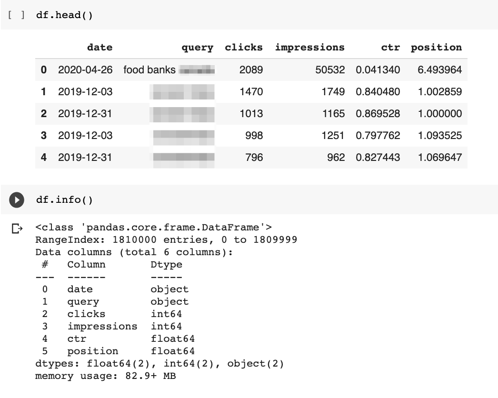

# Isolating 15% Unknown Queries from Search Console

গুগলের তথ্য অনুসারে গুগল প্রতিদিন ১৫% কিওয়ার্ড সার্চ হয় যেগুলা আগে কখনো হয় নি । এই ১৫% কিওয়ার্ডে SERP কিন্তু  ফাকা থাকে না । কোন না কোন ওয়েব সাইটকে তো SERP তে দেখাতেই হয় । এই কিওয়ার্ডের ডাটা গুলা জমা হয় আমাদের সার্চ কন্সোলে । এই টিউটোরিয়ালে সার্চ কন্সোল থেকে ডাটা গুলা কিভাবে আলাদা করতে হয় সেটাই দেখানোর চেষ্টা করছি । 

কৃতজ্ঞতাঃ এই টিউটোরিয়ালের জন্য কৃতজ্ঞতা জ্ঞাপন করছি প্রয়াত  হেমলেট বাতিস্তা কাছে (https://twitter.com/hamletbatista )। উনি এসইও জগতকে মেশিন লার্নিং ও অটোমেশনের মাধ্যমে অন্যন্য উচ্চতায় নিয়ে গেছেন। 

যা যা লাগবে 

১. https://www.anaconda.com/products/distribution 
 
 ফ্রি কমিউনিটি ভার্সন ডাউনলোড করে নিলেই হবে । 

 ২. Search Analytics For Sheets: 

 https://workspace.google.com/marketplace/app/search_analytics_for_sheets/1035646374811

 ৩. সার্চ কন্সোলের এক্সেস । 


কোড ফাইল এই রিপোজটরিতে দেওয়া আছে । রিপোজটরি টি ক্লোন করতে কমান্ড প্রম্পটে টাইপ করুন 

```code
git clone https://github.com/aouwalitshikkha/Isolating-the-15-Unknown-Queries-from-Search-Console-.git

```

ডেমো সিএসভি ফাইল এর ছবি 


